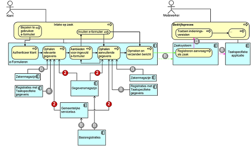

# Techniek Prefill eFormulierenservices

## Procesinteracties en systeemcomponenten
De specificatie beschrijft drie referentiecomponenten. Dit zijn:

* E-formulierenapplicatie
* Gegevensmagazijn
* Gemeentelijke servicebus

Onderstaand overzicht beschrijft het applicatielandschap met de te standaardiseren proces- en systeeminteracties. De interacties met een grijs bolletje en een B erin zijn buiten scope geplaatst.

## Definities:
* Referentiecomponent: Lijst van definities zoals opgenomen in de GEMMA Applicatieatlas.
* eFormulierenapplicatie: Systeem voor ondersteuning van het publiceren, ontwerpen, bouwen en beheren van e-Formulieren.
* Gegevensmagazijn: Systeem voor opslag van gemeentelijke basisgegevens (GBA, NHR en BAG). Conform het RSGB. Deze basisgegevens kunnen ook uit de landelijke registratie worden opgevraagd.
* Gemeentelijke servicebus: het gemeentelijke concept om informatiesystemen te koppelen en gegevens te laten uitwisselen.
